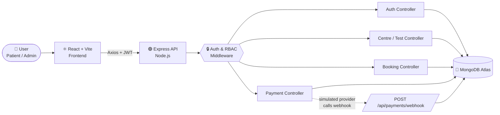
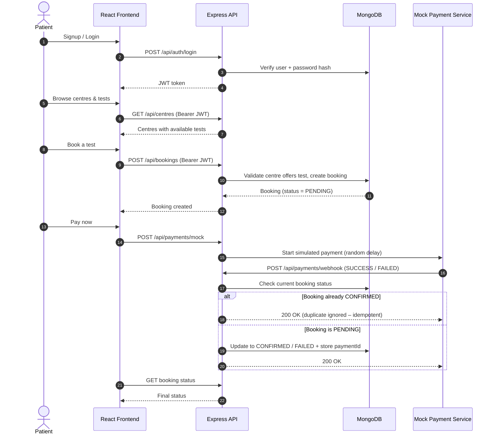
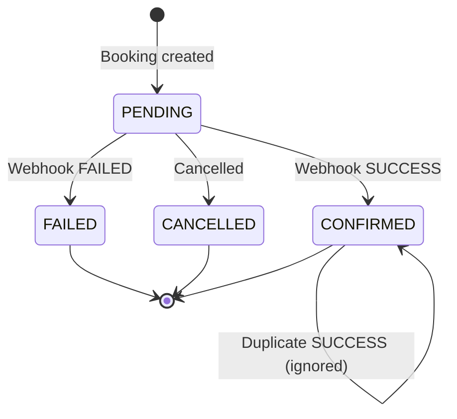
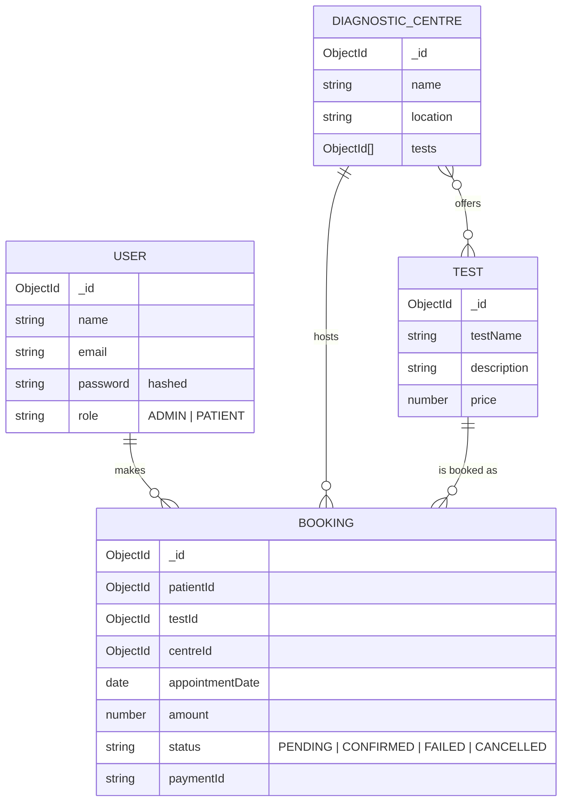

# 🏥 EVE Healthcare – SDE Intern Assignment

A full-stack **diagnostic test booking platform** with JWT authentication, role-based access (Admin / Patient), centre & test management, stateful bookings, and a **simulated payment flow with an idempotent webhook**.
> **Disclaimer:** This repository contains my implementation of an interview/selection assignment. It is an independent candidate submission created for evaluation purposes and does not represent official EVE Healthcare software or employment work.


| | |
|---|---|
| 🌐 **Live App** | https://eve-assignment.vercel.app/ |
| 💻 **Repository** | https://github.com/Abhayv273/EVE_ASSIGNMENT |
| 👤 **Author** | Abhay Verma – [GitHub](https://github.com/Abhayv273) · [LinkedIn](https://linkedin.com/in/abhay-verma-36488325b) |

---

## 📑 Table of Contents
1. [Features](#-features)
2. [Tech Stack](#-tech-stack)
3. [System Architecture & Flow](#-system-architecture--flow)
4. [Project Structure](#-project-structure)
5. [Run Locally (Step by Step)](#-run-locally-step-by-step)
6. [Run with Docker (Bonus)](#-run-with-docker-bonus)
7. [Run the Tests](#-run-the-tests)
8. [Database Schema](#-database-schema)
9. [API Reference](#-api-reference)
10. [Testing the Full Flow with cURL](#-testing-the-full-flow-with-curl)
11. [Assumptions & Engineering Decisions](#-assumptions--engineering-decisions)
12. [Edge Cases Handled](#-edge-cases-handled)
13. [Future Improvements](#-future-improvements)

---

## ✨ Features
- 🔐 **JWT authentication** – signup/login with hashed passwords (bcrypt)
- 🛡️ **Role-Based Access Control** – `ADMIN` and `PATIENT` roles enforced via middleware
- 🏢 **Diagnostic centre & test management** – admins add centres/tests; patients browse them
- 📅 **Stateful bookings** – `PENDING → CONFIRMED / FAILED / CANCELLED`
- 💳 **Mock payment service** with a simulated delay that calls the webhook programmatically
- 🔁 **Idempotent webhook** – duplicate provider events never corrupt data
- ✅ **Tested** with Vitest, React Testing Library and Supertest
- 🐳 **Docker & Docker Compose** support (bonus)

---
### 🖼️ Flow diagram (image)


---


## 🛠 Tech Stack

| Layer | Technology |
|---|---|
| Backend | Node.js, Express.js |
| Database | MongoDB Atlas (Mongoose ODM) |
| Frontend | React.js, Vite, Axios |
| Auth | JSON Web Tokens (JWT) |
| Testing | Vitest, React Testing Library, Supertest |
| DevOps (Bonus) | Docker, Docker Compose |

---

## 🏗 System Architecture & Flow


### 1️⃣ High-level architecture



### 2️⃣ End-to-end flow: Signup → Booking → Payment Webhook



### 3️⃣ Booking status lifecycle



> 🖼️ **Flow diagram image (optional):**
> ``

---

## 📁 Project Structure

```
EVE_ASSIGNMENT/
├── Backend/                # Node.js + Express API
│   ├── src or root files   # routes, controllers, models, middleware
│   ├── .env                # (you create this – see below)
│   └── package.json
├── Frontend/               # React + Vite client
│   ├── src/
│   ├── .env                # (you create this – see below)
│   └── package.json
├── docker-compose.yml      # Bonus: run everything with Docker
└── README.md
```

---

## ⚙️ Run Locally (Step by Step)

### ✅ Prerequisites
Make sure these are installed:

| Tool | Version | Check |
|---|---|---|
| Node.js | v18 or higher | `node -v` |
| npm | v9 or higher | `npm -v` |
| Git | any | `git --version` |
| MongoDB | Atlas account **or** local MongoDB | – |

### Step 1 – Clone the repository
```bash
git clone https://github.com/Abhayv273/EVE_ASSIGNMENT.git
cd EVE_ASSIGNMENT
```

### Step 2 – Set up the Backend
```bash
cd Backend
npm install
```

Create a file named **`.env`** inside the `Backend/` folder:

```env
PORT=5000
MONGO_URI=your_mongodb_atlas_connection_string
JWT_SECRET=your_super_secret_jwt_key
```

> 💡 **How to get `MONGO_URI`:** MongoDB Atlas → *Create Cluster* → *Connect* → *Drivers* → copy the connection string and replace `<password>`. Also add your IP under **Network Access** (or allow `0.0.0.0/0` for testing).
> For a local MongoDB you can use: `mongodb://127.0.0.1:27017/eve-healthcare`

Start the backend:
```bash
npm run dev
```
✅ Backend runs on **http://localhost:5000**

### Step 3 – Set up the Frontend *(open a new terminal)*
```bash
cd Frontend
npm install
```

Create a file named **`.env`** inside the `Frontend/` folder:

```env
VITE_BACKEND_API_URL=http://localhost:5000
```

Start the frontend:
```bash
npm run dev
```
✅ Frontend runs on **http://localhost:5173**

### Step 4 – Use the app
1. Open **http://localhost:5173**
2. Sign up as an **ADMIN** → add diagnostic tests and centres
3. Sign up (or log in) as a **PATIENT** → browse centres → book a test
4. Click **Pay** → the mock payment triggers the webhook → booking becomes `CONFIRMED` or `FAILED`

### 🧯 Troubleshooting

| Problem | Fix |
|---|---|
| `MongooseServerSelectionError` | Check `MONGO_URI` and whitelist your IP in Atlas Network Access |
| `EADDRINUSE: port 5000` | Change `PORT` in `Backend/.env` and update `VITE_BACKEND_API_URL` accordingly |
| CORS / network error in browser | Make sure backend is running and `VITE_BACKEND_API_URL` has no trailing slash |
| `401 Unauthorized` | Token missing/expired – log in again |
| Frontend still uses old env values | Restart `npm run dev` after editing `.env` |

---

## 🐳 Run with Docker (Bonus)

```bash
git clone https://github.com/Abhayv273/EVE_ASSIGNMENT.git
cd EVE_ASSIGNMENT
docker compose up --build
```
Make sure the `.env` files described above exist before running. Stop with `docker compose down`.

---

## 🧪 Run the Tests

```bash
# Backend (Vitest + Supertest)
cd Backend
npm test

# Frontend (Vitest + React Testing Library)
cd ../Frontend
npm test
```

---

## 🗄️ Database Schema



| Collection | Fields |
|---|---|
| **User** | `name`, `email`, `password` (hashed), `role` (`ADMIN` / `PATIENT`) |
| **Diagnostic Centre** | `name`, `location`, `tests` (array of Test ObjectIds) |
| **Test** | `testName`, `description`, `price` |
| **Booking** | `patientId`, `testId`, `centreId`, `appointmentDate`, `amount`, `status`, `paymentId` |

---

## 🔗 API Reference

| Method | Endpoint | Description | Auth Required |
|---|---|---|---|
| POST | `/api/auth/signup` | Register a new `PATIENT` or `ADMIN` | No |
| POST | `/api/auth/login` | Authenticate user and return JWT | No |
| GET | `/api/centres` | List diagnostic centres and their tests | Yes |
| POST | `/api/bookings` | Create a booking with `PENDING` status | Yes (Patient) |
| POST | `/api/payments/mock` | Simulate a payment initiation | Yes |
| POST | `/api/payments/webhook` | Receive payment status (`SUCCESS` / `FAILED`) | No (Webhook) |

> Protected routes need the header: `Authorization: Bearer <JWT_TOKEN>`

---

## 🧾 Testing the Full Flow with cURL

> Replace IDs/tokens with real values from your responses. Request body field names should match your implementation.

**1. Signup**
```bash
curl -X POST http://localhost:5000/api/auth/signup \
  -H "Content-Type: application/json" \
  -d '{"name":"Test Patient","email":"patient@test.com","password":"Test@123","role":"PATIENT"}'
```

**2. Login (copy the token)**
```bash
curl -X POST http://localhost:5000/api/auth/login \
  -H "Content-Type: application/json" \
  -d '{"email":"patient@test.com","password":"Test@123"}'
```

**3. List centres**
```bash
curl http://localhost:5000/api/centres -H "Authorization: Bearer <TOKEN>"
```

**4. Create a booking**
```bash
curl -X POST http://localhost:5000/api/bookings \
  -H "Authorization: Bearer <TOKEN>" -H "Content-Type: application/json" \
  -d '{"testId":"<TEST_ID>","centreId":"<CENTRE_ID>","appointmentDate":"2026-11-01"}'
```

**5. Initiate mock payment**
```bash
curl -X POST http://localhost:5000/api/payments/mock \
  -H "Authorization: Bearer <TOKEN>" -H "Content-Type: application/json" \
  -d '{"bookingId":"<BOOKING_ID>"}'
```

**6. Prove idempotency – send the same webhook twice**
```bash
curl -X POST http://localhost:5000/api/payments/webhook \
  -H "Content-Type: application/json" \
  -d '{"bookingId":"<BOOKING_ID>","paymentId":"<PAYMENT_ID>","status":"SUCCESS"}'
```
Run it again – the second call is safely ignored and the booking stays `CONFIRMED` with no duplicates.

---

## 🧠 Assumptions & Engineering Decisions

- **Tech stack (Node.js/MongoDB vs. Python/PostgreSQL):** The assignment preferred PostgreSQL/Python, but I used the MERN stack. This was driven by my strong expertise in this ecosystem, which let me deliver a robust, well-tested, production-ready application within the estimated timeframe.
- **Mock payment service:** Since real payment gateways were excluded, `/api/payments/mock` generates a random simulated transaction delay and then programmatically calls the webhook endpoint, acting like an external payment provider.
- **Stateless auth:** JWT is used so the API stays horizontally scalable with no server-side sessions.
- **Booking as the transactional core:** It references patient, test and centre, and carries the payment state.

---

## 🛡️ Edge Cases Handled

- **Idempotent webhooks:** `/api/payments/webhook` is strictly idempotent. If the provider sends the same `SUCCESS` event multiple times for the same transaction, the system checks the booking state; if it is already `CONFIRMED`, the duplicate is safely ignored – no corrupted data, no duplicate bookings.
- **Role-Based Access Control (RBAC):** Patients cannot access Admin routes (e.g. adding tests/centres) and Admins cannot book tests as patients – enforced through JWT middleware.
- **Invalid reference IDs:** Handles booking a test at a centre that does not offer it, and malformed MongoDB ObjectIds.

---

## 🚀 Future Improvements

With more time, I would add:
- **Redis caching** for the centres/tests list to reduce database reads
- **Rate limiting** on authentication and booking routes to prevent abuse
- **Structured logging** with Winston or Pino
- **Message broker / background queue** for webhook processing and notification emails

---

## 📬 Contact

**Abhay Verma** · [GitHub](https://github.com/Abhayv273) · [LinkedIn](https://linkedin.com/in/abhay-verma-36488325b)

⭐ Thank you for reviewing my submission!
